# retro-go-hardware

## Hardware for the RetroGo (ducalex)

Software for this hardware

https://github.com/Akrobate/retro-go

## Configurations

You can configure all projects params from `configurations/global.scad`.

## Construction log

You can see my [construction log](log/README.md) with real device photos and steps

## Main project

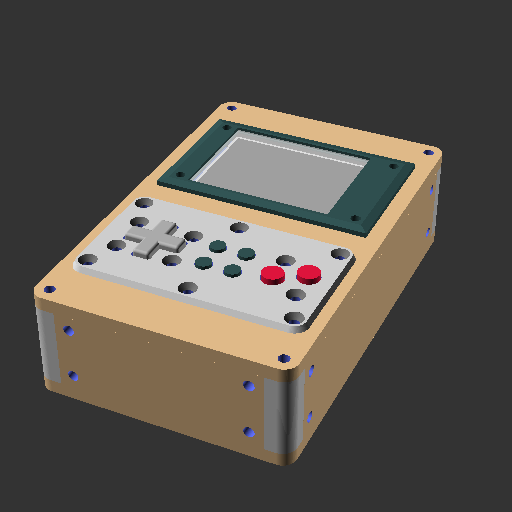

## Components

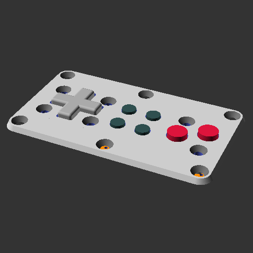
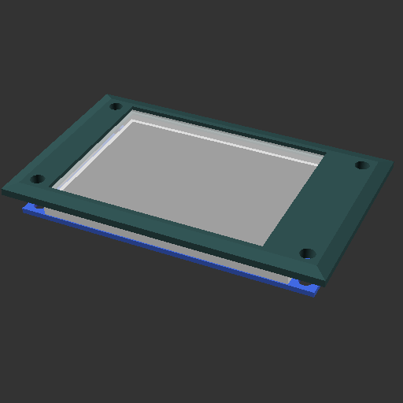
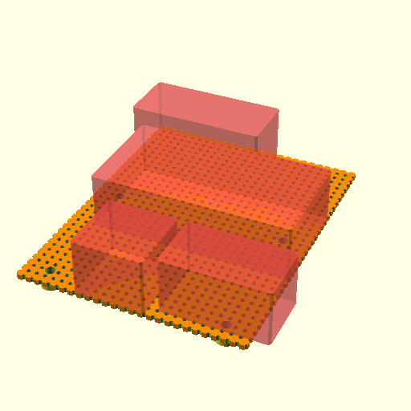
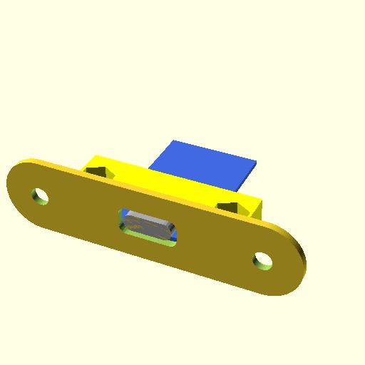
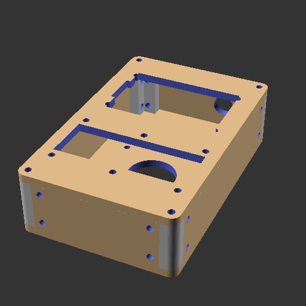
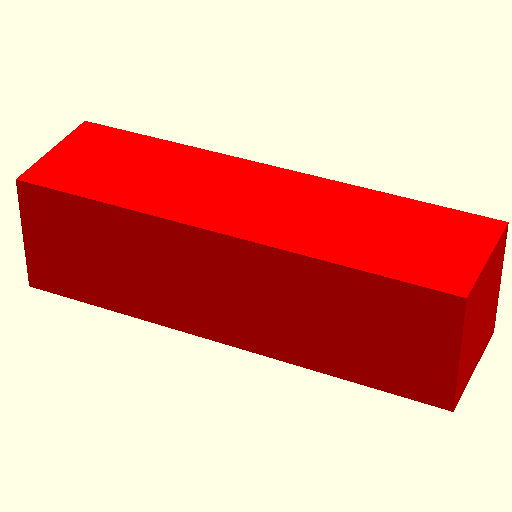

## Pieces

### Housing
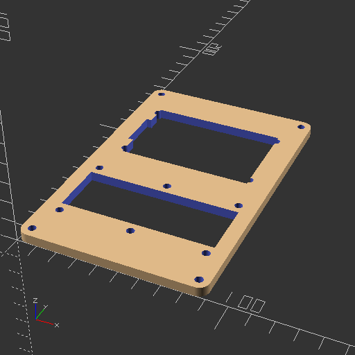
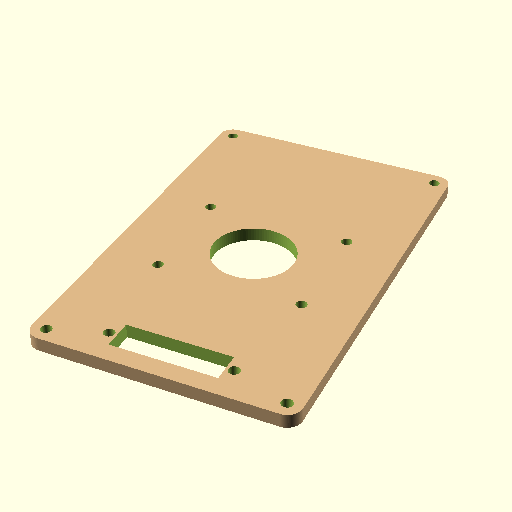
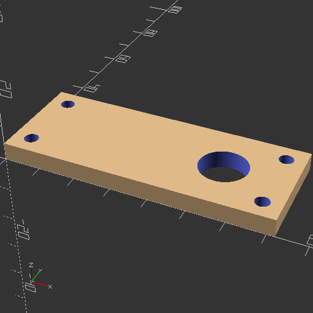
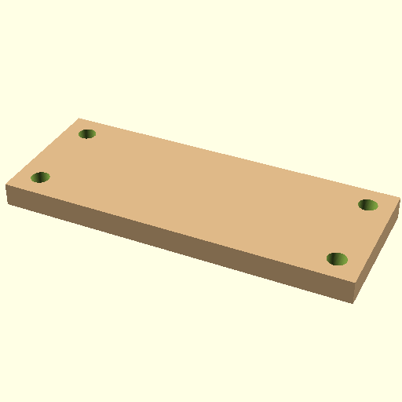
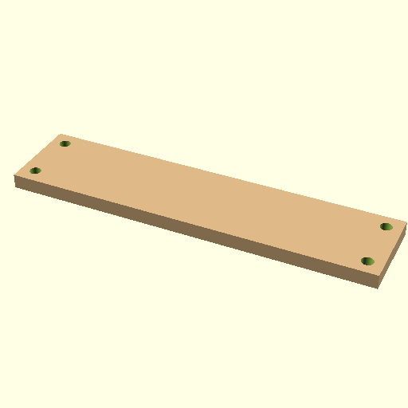
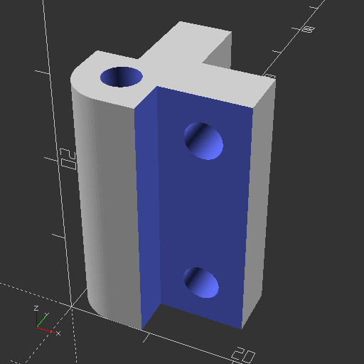

### Gamepad controller
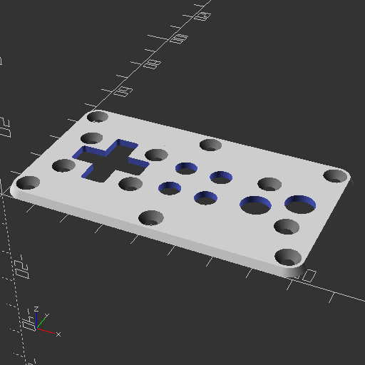
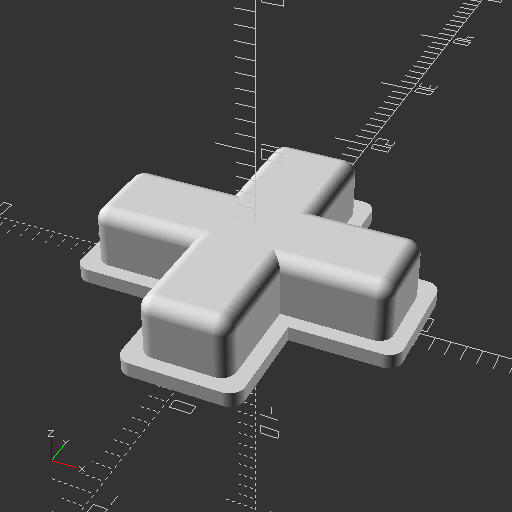
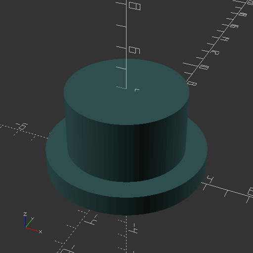
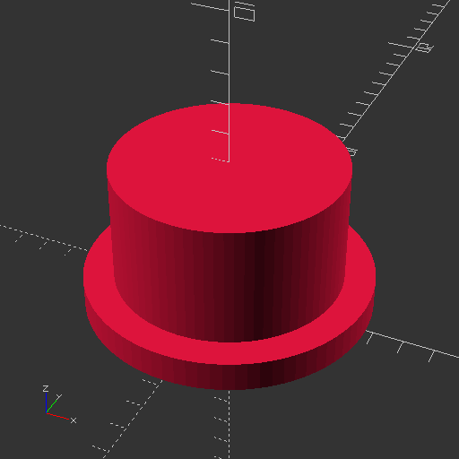
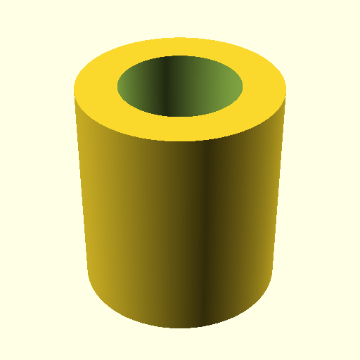

### Screen
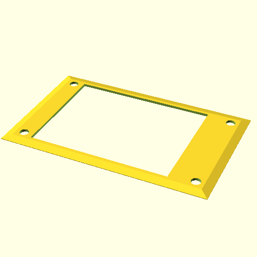
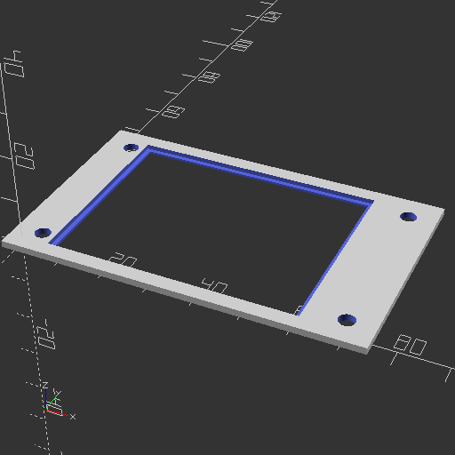
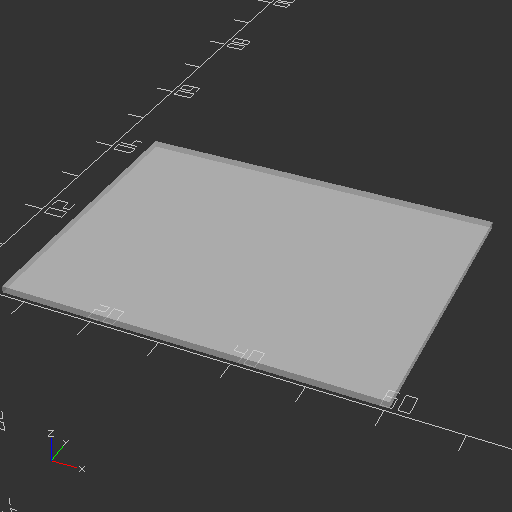

### Speaker
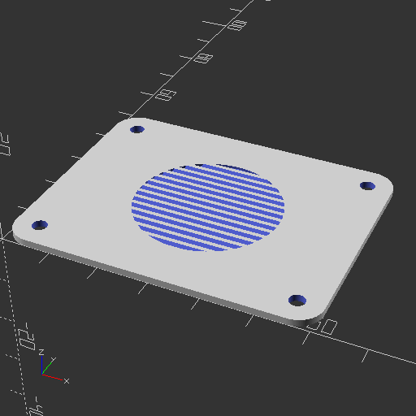

### USB Charger
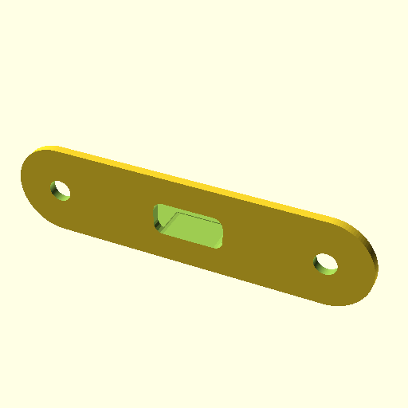
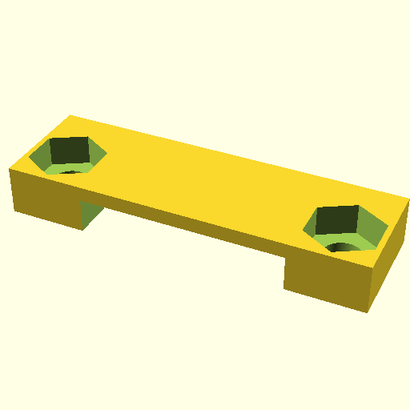

### Mother board

Mother board positionning components

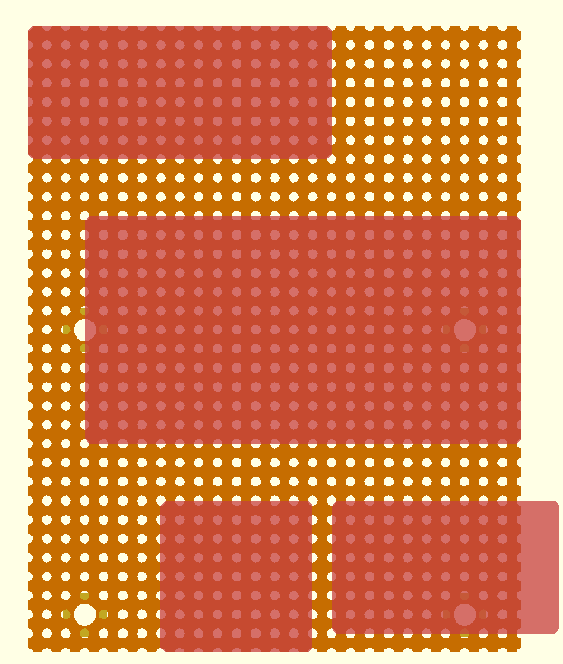

Mother bard fixation throws

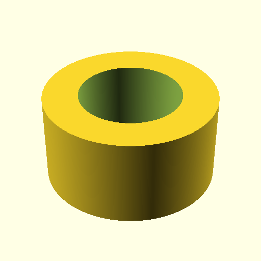
