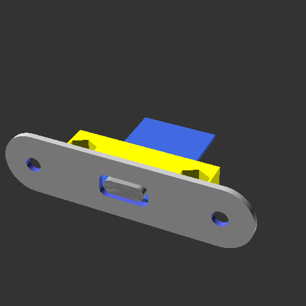
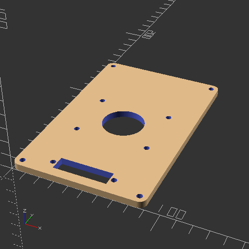
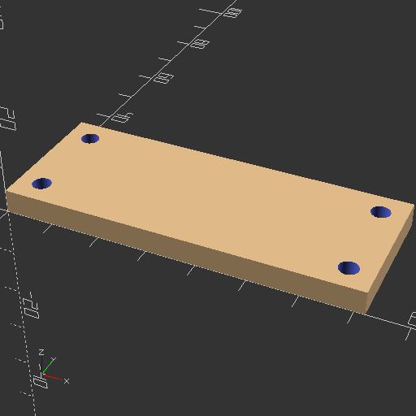
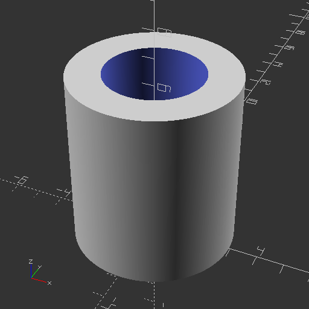
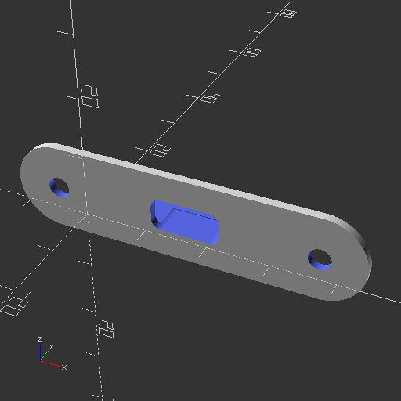
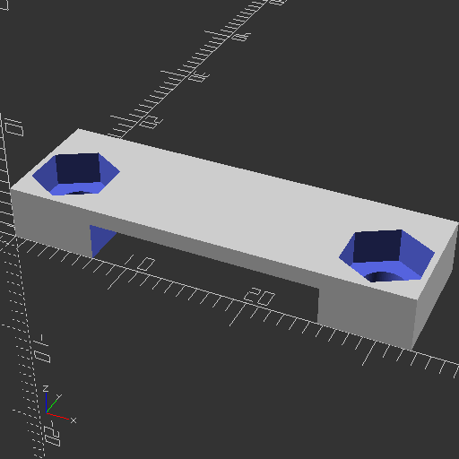
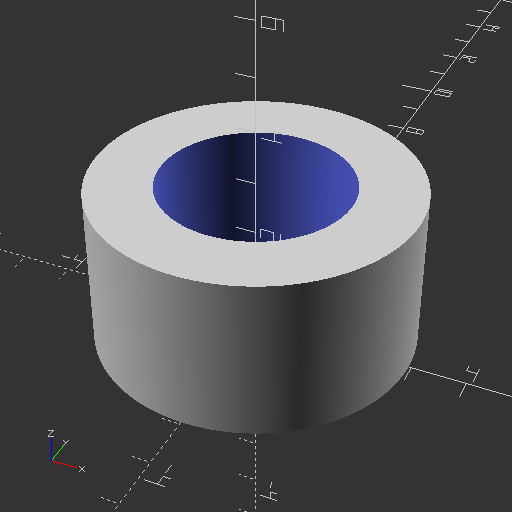

# retro-go-hardware

## Hardware for the RetroGo (ducalex)

Software for this hardware
https://github.com/Akrobate/retro-go

This is a fork of 
https://github.com/ducalex/retro-go

To be sure to have the most adapted version for now for this hardware use https://github.com/Akrobate/retro-go, but most recent version of firmware is on https://github.com/ducalex/retro-go. The author accepted my important updates so this harware should perfectly work with the original code.


## Construction log

You can see my [construction log](construction-log/README.md) with real device photos and steps


## Pieces for project

[List of all electronic and not electronics parts](electronic/README.md)


## Generate png previews

```bash
./generate_png_files.sh
```

Output files will be stored in `./png_files/`


## Generate png previews

```bash
./generate_stl_files.sh
```

Output files will be stored in `./stl_files/`

## Configurations

You can configure all projects params from `configurations/global.scad`.


## Main project


## Components





## Pieces

### Housing






### Gamepad controller




### Screen


### Speaker


### USB Charger



### Mother board

Mother board positionning components


Mother bard fixation throws


